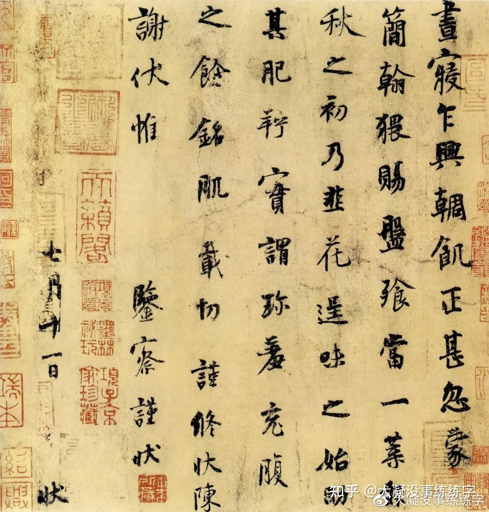
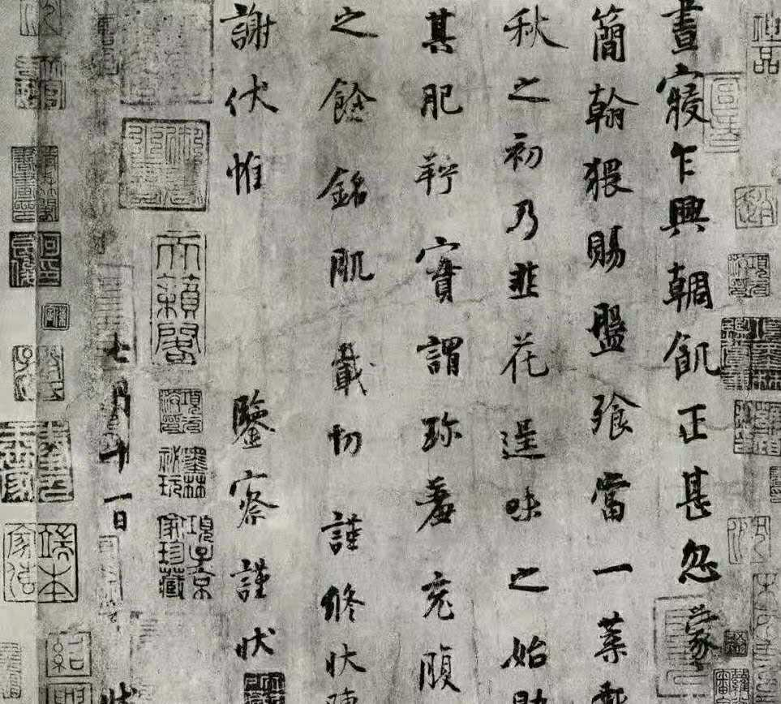
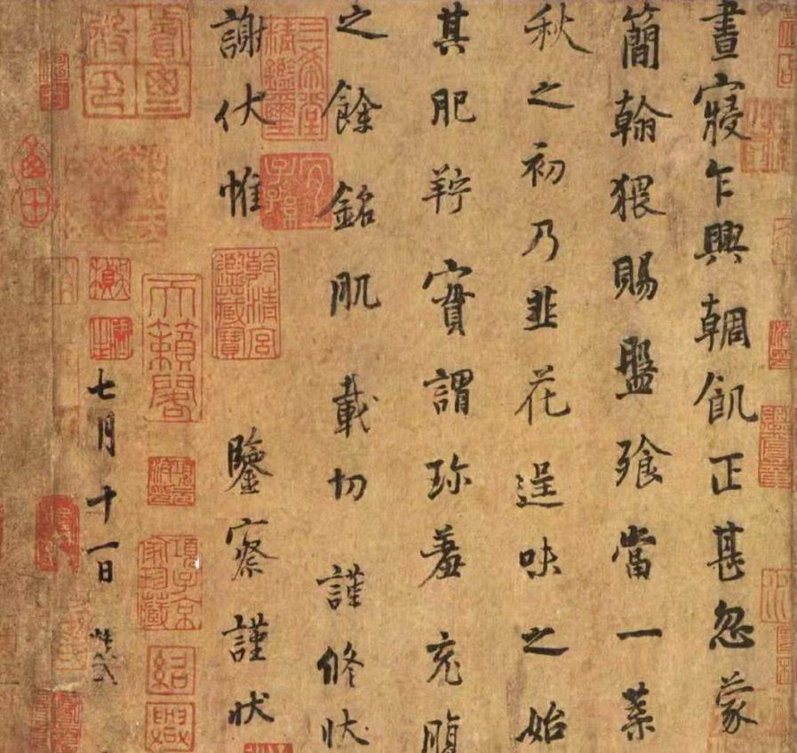
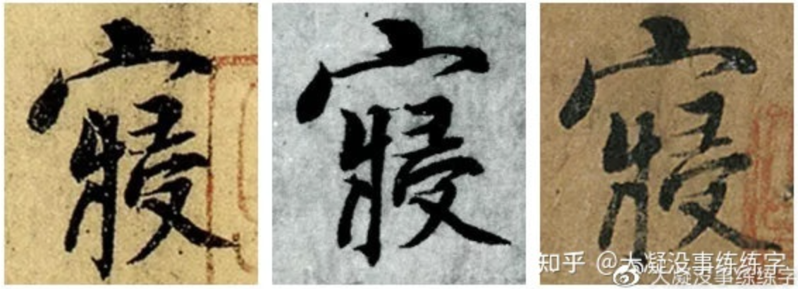
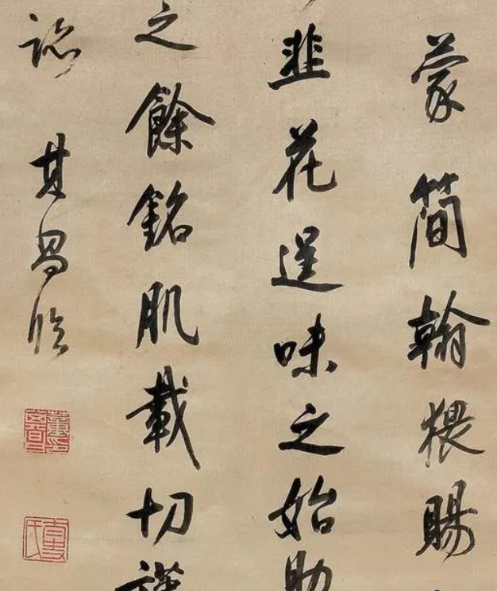
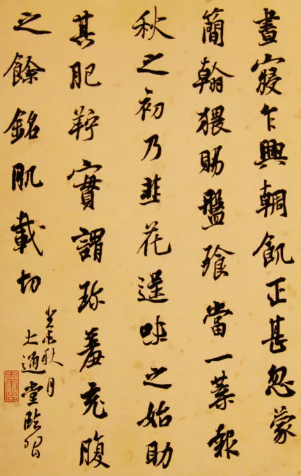

# 韭花帖

## 概述

《韭花帖》是唐末五代书法家杨凝式创作的墨迹本行书作品  ，有“天下第五行书”之称 ，现存3个藏本，分别藏于无锡博物院和台北故宫博物院，罗振玉藏本不知去向。 
《韭花帖》是杨凝式醒后饥饿无比，得韭花珍馐而食，心中惬意故灵感大发写下。字体点画生动，结构端稳，风神简静，全帖表现出入规入矩的端庄与温雅，结体妍丽，并以精严的技巧表达出含蓄内在的文人之气。用笔一丝不苟，却不显得古板呆滞，巧妙地将内擫和外拓的笔法融为一体。 

《韭花帖》，是杨凝式为了答谢友人赠与他美食所写的一封手札，麻纸迹本，高26厘米，宽28厘米，共7行，63字，字体在楷书和行书之间。

黄庭坚是这样评价杨凝式，“世人尽学兰亭面，欲换凡骨无金丹；谁知洛阳杨风子，下笔便到乌丝栏。” 

杨凝式厌恶世俗，不喜尺牍，所以流传下来的作品少之又少，存世经由四帖为著名。而四帖当中，《韭花帖》在书法史上地位重要，是千古不朽的作品。

## 字帖

《韭花帖》罗振玉藏本

罗振玉藏本藏于上虞罗振玉处所，1945年在长春寓所遗失，至今下落不明。罗本《韭花帖》目前被学界认定为真迹。

《韭花帖》兰千山馆藏本  

《韭花帖》清内府本（无锡博物院藏）

## 释文

“昼寝乍兴，輖饥正甚，忽蒙简翰，猥赐盘飧，当一叶报秋之初，乃韭花逞味之始，助其肥羜，实谓珍羞，充腹之馀，铭肌载切，谨修状陈谢！伏惟鉴察，谨状！七月十一日，状。”

大概的意思就是：我午觉刚刚醒来，肚子正在饿着，忽然收到您的一封信，赐予这么一大盘的食物。正是一叶报秋的初秋时节，也正是韭菜花味道最好的时候，用来配佐肥美的羊肉，实在是太美味了。吃饱之后，感觉身体实在太舒服了。我特意写这一封信来表达我的谢意。

## 对比

从圆厚的角度上讲，兰本更胜一筹；从书写的水平而言兰本更高一些，其次式罗本，再次是清本。

第一行里，可以重点看一下“**寝**”字：
首先是第一点，兰本和清本更多的是圆，而罗本圆中带方。其次看底下的彐和又，兰本和清本更方正，而罗本欹侧取态。

第二行可以看一下"赐"字，这也是能一眼就看出罗本不同的字：首先，我们看字里的空白空间，兰本和清本更规整、更平均，罗本的疏密对比则更明显；其次，我们看赐右边的横折，罗本对这一笔的处理也是明显不同，更媚更张扬。

第三行可以看一下"**韭"**字，罗本的左密右疏、左重右轻最明显。

第四行不妨看一下"**羞"**字：
首先，从字里空间的疏密来看，还是罗本更密，对比更鲜明；其次，看那个长撇，罗本更直更有力。

第五行有一个明显区别，罗本的"馀"字不完整，兰本、清本则是清晰的。

第六行说一个印章上的不同，清本惟字底下有一个“乾清宫鉴藏宝”的印章，充分说明了它的来历。

第七行，也是最后一行，这里有罗本最显眼的一个特征。兰本和清本多少有“凝式”两字的落款，虽然并不完整，但罗本是完全没有。

《韭花帖》以宽疏、散朗的独特章法夺世人眼目。字与字，行与行之间，留有大片的空白，在此之前，流传下来的重要书法作品从来没有出现这样的章法。《韭花帖》中的每一个字都趋于平和简静，给人一种旷远之感，用笔和缓，笔画气息沉着。通篇给人的感觉就是一个白衣秀士，举手投足之间，从容自若。从书法意趣的追求来看，其于不期然中走出了唐人书法的境界而开一片天地，身后又开启了宋代尚意书法。

《韭花帖》结构严谨却不失森严密布，通篇秀雅恬淡，二王精髓毕现，魏晋风神十足，可谓是作者“心手双畅，翰逸神飞”的佳作。章法布局更是独特，字距较大，行距更宽，疏朗而又浑然一体，在空间之中充满了平和之气。这种行距、字距都留得很宽绰的章法，得益于甲骨文、两周金文和汉隶的疏散排布。

《韭花帖》的出现是杨凝品尝美食之后的灵感迸发，以精到的中锋用笔、流美的线条分割空白，形成虚实相生、变化无穷的空间。在时空交错中，点画振动，计白当黑，墨华鲜润，云光徘徊。整篇的布局看似随意，但细细品味能发现妙趣横生，实在是佩服杨凝式的境界高深。

董其昌极为推崇《韭花帖》：“少师韭花帖，略带行体，萧散有致，比少师他书欹侧取态者有殊，然欹侧取态，故是少师佳处。，清代王文治为香光真知音者：“韭花一帖重谬琳，千古华亭最赏音。想见昼眠人乍起，麦光铺案写秋阴。”

书法家陈忠康临《韭花帖》：

